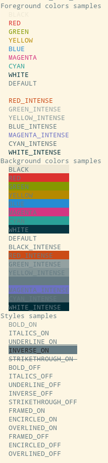

<a name="top"></a>

# FACE []() [](https://gitter.im/szaghi/FACE?utm_source=badge&utm_medium=badge&utm_campaign=pr-badge&utm_content=badge)

[]()
[]()
[]()
[]()

[]()
[](https://travis-ci.org/szaghi/FACE)
[](http://codecov.io/github/szaghi/FACE?branch=master)

### FACE, Fortran Ansi Colors (and Styles) Environment

> A KISS pure Fortran Library for easy *colorize* (and stylize) strings.

- FACE is a pure Fortran (KISS) library;
- FACE is Fortran 2008+ standard compliant;
- FACE is tiny;
- FACE is a Free, Open Source Project.

#### A taste of FACE

```fortran
use face
print '(A)', colorize('Hello', color_fg='red')//colorize(' World', color_fg='blue', style='underline_on')
```

#### Issues

[]()
[](https://waffle.io/szaghi/FACE)
[](https://waffle.io/szaghi/FACE)
[](https://waffle.io/szaghi/FACE)

#### Compiler Support

[]()
[]()
[]()
[]()
[]()
[]()

---

| [What is FACE?](#what-is-face) | [Main features](#main-features) | [Copyrights](#copyrights) | [Documentation](#documentation) | [Install](#install) |

---

## What is FACE?

> **FACE** is KISS pure Fortran library for easy *colorize* (and *stylize*) strings: FACE allows for easy handling of *Ansi Colors and Styles codes* providing a user-friendly Fortran *environment*... just one **function** :smile:

## Main features

> FACE is a library allowing

+ [x] easy handle of *Ansi Colors and Styles Codes*;
* [x] Test Driven Developed (TDD);
* [x] collaborative developed;
* [x] well documented;
* [x] free!

Any feature request is welcome.

Go to [Top](#top)

## Copyrights

FACE is a Free and Open Source Software (FOSS), it is distributed under a **very permissive** multi-licensing system: selectable licenses are [GPLv3](http://www.gnu.org/licenses/gpl-3.0.html), [BSD2-Clause](http://opensource.org/licenses/BSD-2-Clause), [BSD3-Clause](http://opensource.org/licenses/BSD-3-Clause) and [MIT](http://opensource.org/licenses/MIT), feel free to select the license that best matches your workflow.

> Anyone is interest to use, to develop or to contribute to FACE is welcome.

More details can be found on [wiki](https://github.com/szaghi/FACE/wiki/Copyrights).

Go to [Top](#top)

---

## Documentation

Besides this README file the FACE documentation is contained into its own [wiki](https://github.com/szaghi/FACE/wiki). Detailed documentation of the API is contained into the [GitHub Pages](http://szaghi.github.io/FACE/index.html) that can also be created locally by means of [ford tool](https://github.com/cmacmackin/ford).

### Usage

FACE expose only 3 procedures:

1. `colorize` the main function;
2. `colors_samples` an helper subroutine that prints to standard output a sample of all colors available;
3. `styles_samples` an helper subroutine that prints to standard output a sample of all styles available;

The usage is extremely simple, `colorize` returns an allocatable character with the requested (foreground and background) colors and style, while the 2 helper subroutines have not dummies:

```fortran
use face
character(len=:), allocatable :: error_message

error_message = colorize('error:', color_fg='red', style='underline_on')//' file not found!'

print '(A)', error_message
print '(A)', colorize('suggestion: check you configuration', color_fg='blue')

call colors_samples ! print samples of all colors available
call styles_samples ! print samples of all styles available
```

#### Colorize

`colorize` is the main function used to colorize and stylize the input string. Its signature is:

```fortran
pure function colorize(string, color_fg, color_bg, style) result(colorized)
  character(len=*), intent(in)           :: string    ! Input string.
  character(len=*), intent(in), optional :: color_fg  ! Foreground color definition.
  character(len=*), intent(in), optional :: color_bg  ! Background color definition.
  character(len=*), intent(in), optional :: style     ! Style definition.
  character(len=:), allocatable          :: colorized ! Colorized string.
end function colorize
```

+ `string` is the input string;
+ `color_fg` is the foreground color definition and it is optional;
+ `color_bg` is the background color definition and it is optional;
+ `style` is the style definition and it is optional;

> + colors and style definitions are case **insensitive**;
> + no warning is returned if the colors or style definitions are wrong (or not available): in case the color or style are simply not applied.

### Available Colors and Styles



Go to [Top](#top)

## Install

FACE is a Fortran library composed by several modules.

> Before download and compile the library you must check the [requirements](https://github.com/szaghi/FACE/wiki/Requirements).

To download and build the project two main ways are available:

+ exploit the [install script](#install-script) that can be downloaded [here](https://github.com/szaghi/FACE/releases/latest)
+ [manually download and build](#manually-download-and-build):
  + [download](#download)
  + [build](#build)

---

### install script

FACE ships a bash script (downloadable from [here](https://github.com/szaghi/FACE/releases/latest)) that is able to automatize the download and build steps. The script `install.sh` has the following usage:

```shell
→ ./install.sh
Install script of FACE
Usage:

install.sh --help|-?
    Print this usage output and exit

install.sh --download|-d <arg> [--verbose|-v]
    Download the project

    --download|-d [arg]  Download the project, arg=git|wget to download with git or wget respectively
    --verbose|-v         Output verbose mode activation

install.sh --build|-b <arg> [--verbose|-v]
    Build the project

    --build|-b [arg]  Build the project, arg=fobis|make|cmake to build with FoBiS.py, GNU Make or CMake respectively
    --verbose|-v      Output verbose mode activation

Examples:

install.sh --download git
install.sh --build make
install.sh --download wget --build cmake
```

> The script does not cover all possibilities.

The script operation modes are 2 (*collapsible* into one-single-mode):

+ download a new fresh-clone of the latest master-release by means of:
  + [git](https://git-scm.com/);
  + [wget](https://www.gnu.org/software/wget/) (also [curl](https://curl.haxx.se/) is necessary);
+ build a fresh-clone project as static-linked library by means of:
  + [FoBiS.py](https://github.com/szaghi/FoBiS);
  + [GNU Make](https://www.gnu.org/software/make/);
  + [CMake](https://cmake.org/);

> you can mix any of the above combinations accordingly to the tools available.

Typical usages are:

```shell
# download and prepare the project by means of git and build with GNU Make
install.sh --dowload git --build make
# download and prepare the project by means of wget (curl) and build with CMake
install.sh --dowload wget --build cmake
# download and prepare the project by means of git and build with FoBiS.py
install.sh --dowload git --build fobis
```

---

### manually download and build

#### download

To download all the available releases and utilities (fobos, license, readme, etc...), it can be convenient to _clone_ whole the project:

```shell
git clone https://github.com/szaghi/FACE
cd FACE
```

Alternatively, you can directly download a release from GitHub server, see the [ChangeLog](https://github.com/szaghi/FACE/wiki/ChangeLog).

#### build

The most easy way to compile FACE is to use [FoBiS.py](https://github.com/szaghi/FoBiS) within the provided fobos file.

Consequently, it is strongly encouraged to install [FoBiS.py](https://github.com/szaghi/FoBiS#install).

| [Build by means of FoBiS](#build-by-means-of-fobis) | [Build by means of GNU Make](#build-by-means-of-gnu-make) | [Build by means of CMake](#build-by-means-of-cmake) |

---

#### build by means of FoBiS

FoBiS.py is a KISS tool for automatic building of modern Fortran projects. Providing very few options, FoBiS.py is able to build almost automatically complex Fortran projects with cumbersome inter-modules dependency. This removes the necessity to write complex makefile. Moreover, providing a very simple options file (in the FoBiS.py nomenclature indicated as `fobos` file) FoBiS.py can substitute the (ab)use of makefile for other project stuffs (build documentations, make project archive, etc...). FACE is shipped with a fobos file that can build the library in both _static_ and _shared_ forms and also build the `Test_Driver` program. The provided fobos file has several building modes.

##### listing fobos building modes

Typing:
```bash
FoBiS.py build -lmodes
```
the following message should be printed:
```bash
The fobos file defines the following modes:
  - "face-shared-gnu"
  - "face-static-gnu"
  - "tests-gnu"
  - "face-shared-gnu-debug"
  - "face-static-gnu-debug"
  - "tests-gnu-debug"
  - "face-shared-intel"
  - "face-static-intel"
  - "tests-intel"
  - "face-shared-intel-debug"
  - "face-static-intel-debug"
  - "tests-intel-debug"
```
The modes should be self-explicative: `shared`, `static` and `test-driver` are the modes for building (in release, optimized form) the shared and static versions of the library and the Test Driver program, respectively. The other 3 modes are the same, but in debug form instead of release one. `-gnu` use the `GNU gfortran` compiler while `-intel` the Intel one.

##### building the library

The `shared` or `static` directories are created accordingly to the form of the library built. The compiled objects and mod files are placed inside this directory, as well as the linked library.

###### release shared library

```bash
FoBiS.py build -mode face-shared-gnu
```
###### release static library

```bash
FoBiS.py build -mode face-static-gnu
```
###### debug shared library

```bash
FoBiS.py build -mode face-shared-gnu-debug
```
###### debug static library

```bash
FoBiS.py build -mode face-static-gnu-debug
```

##### building the Test Driver program

The `Test_Driver` directory is created. The compiled objects and mod files are placed inside this directory, as well as the linked program.
###### release test driver program
```bash
FoBiS.py build -mode tests-gnu
```
###### debug test driver program
```bash
FoBiS.py build -mode tests-gnu-debug
```

##### listing fobos rules
Typing:
```bash
FoBiS.py rule -ls
```
the following message should be printed:
```bash
The fobos file defines the following rules:
```
The rules should be self-explicative.

---

#### build by means of GNU Make

To be implemented.

#### Build by means of CMake

To be implemented.

Go to [Top](#top)
