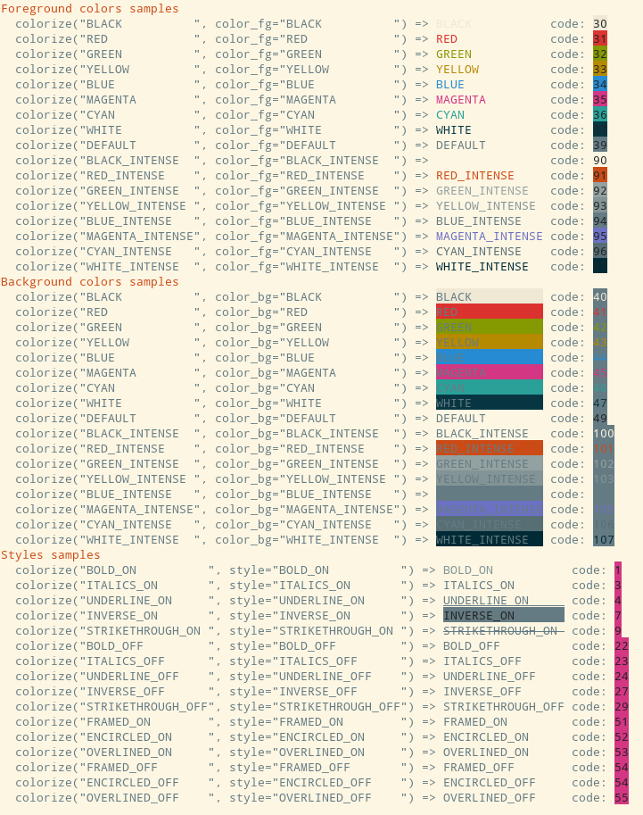

# Features

## A taste of FACE

```fortran
use face
print '(A)', colorize('Hello', color_fg='red')//colorize(' World', color_fg='blue', style='underline_on')
```

## API

FACE exposes only 3 procedures:

1. `colorize` — the main function
2. `colors_samples` — prints a sample of all available colors to standard output
3. `styles_samples` — prints a sample of all available styles to standard output

## Available Colors and Styles

A color is either one of the names below (`red`, `green_intense`, ...) or a 24-bit RGB value
`#rrggbb`, written as the SGR sequence `ESC[38;2;r;g;bm` (foreground) or `ESC[48;2;r;g;bm`
(background). Most modern terminals support 24-bit color; a terminal that does not may show
an approximation or ignore it.

```fortran
print '(A)', colorize('188', color_fg='#2EF5C0')//colorize(' km/h', color_fg='#FFB000', color_bg='#101010')
```


